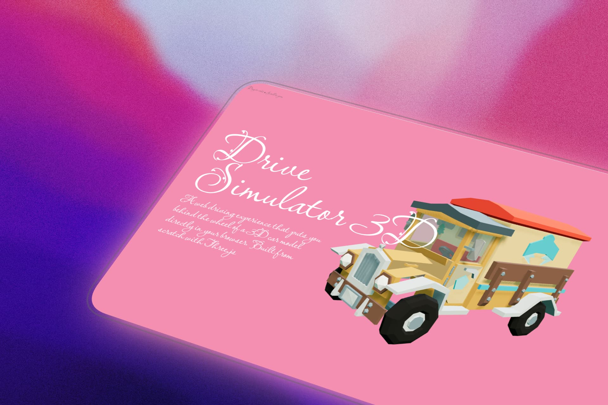

<h1 align="center">Drive Simulator 3D</h1>

<p align="center">
  <em>A browser-native driving experience, sculpted with Three.js</em>
</p>

<p align="center">
  
  
  
</p>

<p align="center">
  
</p>

---

There is something quietly powerful about opening a browser tab and finding yourself behind the wheel of a 3D car — no downloads, no installs, no friction. Just a URL, a canvas, and the road ahead.

**Drive Simulator 3D** is exactly that. A lightweight, hand-crafted driving experience that runs entirely in the browser. Built from scratch with vanilla JavaScript and [Three.js](https://threejs.org/), it proves that immersive 3D doesn't require heavy frameworks or complex build pipelines. Sometimes, all you need is a clear vision and the right APIs.

---

## Table of Contents

- [The Idea](#the-idea)
- [What You Can Do](#what-you-can-do)
- [Under the Hood](#under-the-hood)
- [Project Structure](#project-structure)
- [Quick Start](#quick-start)
- [How to Drive](#how-to-drive)
- [Rendering Architecture](#rendering-architecture)
- [Lighting Design](#lighting-design)
- [How Models Load](#how-models-load)
- [Movement Physics](#movement-physics)
- [Camera Behavior](#camera-behavior)
- [Preview Mode](#preview-mode)
- [Performance Notes](#performance-notes)
- [Browser Compatibility](#browser-compatibility)
- [What Could Come Next](#what-could-come-next)
- [Known Constraints](#known-constraints)
- [Credits](#credits)
- [License](#license)

---

## The Idea

Most web-based 3D projects rely on engines like Unity or Unreal, exported to WebGL through heavy intermediate layers. This project takes a different path — writing every line of rendering, physics, and interaction code directly against the Three.js API.

The result is a project that is **transparent**. You can open any file, read every function, and understand exactly how a 3D scene comes together. There is no magic behind curtains, only JavaScript doing what JavaScript does best.

---

## What You Can Do

- **Drive a 3D car** through a lit environment with realistic shadows
- **Orbit the camera** freely when the car is stationary
- **Watch the camera follow** the car smoothly when you accelerate
- **Use keyboard or touch** — WASD keys on desktop, on-screen buttons on mobile
- **Inspect the model** in a dedicated preview mode with orbit controls
- **Experience dynamic lighting** — six lights, including animated point lights that breathe color into the scene

---

## Under the Hood

| Layer | Choice |
|---|---|
| Language | Vanilla JavaScript (ES6 Modules) |
| 3D Engine | Three.js v0.160.0 via CDN |
| Model Format | GLB (Binary glTF) |
| Styling | Plain CSS |
| Build Step | None |
| Package Manager | None |

> *No `node_modules`. No `package.json`. No bundler configuration. Serve the files and the project runs.*

---

## Project Structure

```
drive-simulator-3d/
│
├── index.html                 ← Main driving simulator
├── preview.html               ← Model inspection view
│
├── css/
│   └── style.css              ← All visual styling
│
├── js/
│   ├── app.js                 ← Core simulator logic
│   └── preview.js             ← Preview scene logic
│
├── model/
│   ├── card.glb               ← The car
│   └── pine.glb               ← Decorative trees
│
├── texture/
│   ├── grav.jpg               ← Ground texture (reserved)
│   └── grav-2.jpg             ← Ground texture variant (reserved)
│
└── img/
    └── Preview.jpg            ← Project screenshot
```

Every file has a purpose. Nothing is decorative clutter.

---

## Quick Start

**1. Clone the repository**

```bash
git clone https://github.com/sebastianvasquezechavarria1234/drive-simulator-3d-thre.js.git
cd drive-simulator-3d-thre.js
```

**2. Start a local server**

```bash
# Python
python -m http.server 8000

# Node.js (if available)
npx serve .

# PHP
php -S localhost:8000
```

**3. Open in your browser**

```
http://localhost:8000
```

> *Opening `index.html` directly via `file://` will not work. ES6 modules require a server context.*

---

## How to Drive

### Keyboard

| Key | Action |
|---|---|
| `W` or `↑` | Accelerate forward |
| `S` or `↓` | Reverse |
| `A` or `←` | Steer left *(only while moving)* |
| `D` or `→` | Steer right *(only while moving)* |
| `Space` | Brake |

### Camera

| Input | Action |
|---|---|
| `Mouse drag` | Orbit around the car *(when stationary)* |
| `Scroll wheel` | Zoom in and out |

### Mobile

Touch-friendly WASD buttons appear in the bottom-right corner of the screen.

---

## Rendering Architecture

The renderer is tuned for visual quality:

```javascript
renderer.toneMapping = THREE.ACESFilmicToneMapping;
renderer.toneMappingExposure = 1.2;
renderer.shadowMap.enabled = true;
renderer.shadowMap.type = THREE.PCFSoftShadowMap;
```

**ACES Filmic tone mapping** compresses high dynamic range values into displayable ranges with a cinematic color response. Combined with **PCF soft shadows**, the scene achieves a polished, grounded look without post-processing passes.

The environment map is generated procedurally — a gradient `DataTexture` fed into a `PMREMGenerator`. This eliminates the need for external HDR files while still producing convincing reflections on metallic and glossy surfaces.

---

## Lighting Design

Six lights compose the scene's visual atmosphere:

| Light | Type | Intensity | Role |
|---|---|---|---|
| Ambient | `AmbientLight` | 0.6 | Fills shadows with soft base color |
| Hemisphere | `HemisphereLight` | 0.8 | Blends sky and ground tones |
| Sun | `DirectionalLight` | 4.0 | Primary shadow caster |
| Fill | `DirectionalLight` | 0.8 | Softens harsh directional shadows |
| Rim | `DirectionalLight` | 2.5 | Adds edge definition from behind |
| Point Red | `PointLight` | 1.5 | Animated atmospheric accent |
| Point Blue | `PointLight` | 1.5 | Animated atmospheric accent |

The two point lights drift vertically using sinusoidal functions, creating a subtle, breathing rhythm that keeps the scene alive even when the car stands still.

---

## How Models Load

GLB models are loaded via `GLTFLoader` and automatically normalized to fit the scene:

```javascript
// Compute bounding dimensions
const box = new THREE.Box3().setFromObject(model);
const size = box.getSize(new THREE.Vector3());
const maxDim = Math.max(size.x, size.y, size.z);
const scale = 2 / maxDim;

// Normalize position and scale
model.scale.setScalar(scale);
model.position.sub(center.multiplyScalar(scale));
model.position.y = -(box.min.y * scale);
```

This normalization ensures any GLB model — regardless of its original coordinate system — sits correctly on the ground plane, centered and proportioned.

Trees are instanced by cloning the original `pine.glb` model and placing copies at fixed world positions with consistent scaling.

---

## Movement Physics

The driving model uses acceleration-based movement rather than rigid body simulation:

| Parameter | Value | Description |
|---|---|---|
| `carMaxSpeed` | 0.5 | Peak forward velocity |
| `carAccel` | 0.008 | Throttle response |
| `carDecel` | 0.015 | Coast-to-stop rate |
| `carBrake` | 0.04 | Deceleration under braking |
| `carRotSpeed` | 0.04 | Steering angular speed |

**Key behaviors:**

- Steering engages only when speed exceeds `0.01` — the car must be moving to turn
- Reverse gear inverts steering direction naturally
- The car is confined within a 40-unit radius from the origin
- Velocity decays smoothly when no input is detected

This approach feels intuitive without requiring a physics engine. Every parameter is tunable, every behavior is predictable.

---

## Camera Behavior

When the car moves, the camera transitions from free orbit to a **follow mode**:

```javascript
if (Math.abs(carSpeed) > 0.01) {
  const offset = new THREE.Vector3(0, 5, 10);
  offset.applyAxisAngle(new THREE.Vector3(0, 1, 0), car.rotation.y + Math.PI);
  camera.position.lerp(car.position.clone().add(offset), 0.08);
  controls.target.lerp(car.position.clone().add(new THREE.Vector3(0, 1, 0)), 0.08);
}
```

The camera lerps toward a position behind and above the car, rotating with the car's heading. When the car stops, `OrbitControls` regain control and the user can freely inspect the scene.

---

## Preview Mode

Accessible at `preview.html`, this stripped-down view removes all driving logic and presents the car model in a clean, orbit-friendly environment.

- No physics, no HUD, no driving
- OrbitControls for full 360-degree inspection
- Project title and description overlay
- Direct link back to the simulator

Use this when you want to showcase the model itself — a digital showroom, free from interaction complexity.

---

## Performance Notes

- **Pixel ratio** is capped at 2x to prevent excessive rendering on high-DPI displays
- **Shadow maps** use 2048x2048 resolution — a balance between quality and GPU cost
- **Fog** uses exponential squared falloff (`FogExp2`) for natural depth fading
- **No post-processing** — the scene relies entirely on material and lighting quality
- **Minimal draw calls** — the scene contains fewer than 20 meshes total

The project runs smoothly on integrated GPUs and mid-range mobile devices.

---

## Browser Compatibility

| Browser | Support |
|---|---|
| Chrome 90+ | Full |
| Firefox 90+ | Full |
| Safari 15+ | Full |
| Edge 90+ | Full |
| Mobile Safari | Full (touch controls) |
| Mobile Chrome | Full (touch controls) |

> *WebGL 2.0 is required. All modern browsers ship with this capability enabled by default.*

---

## What Could Come Next

A project like this is never truly finished. Some directions worth exploring:

- **Collision detection** — prevent the car from passing through trees
- **Multiple vehicles** — load different car models from a selection menu
- **Terrain variation** — hills, slopes, and uneven ground
- **Weather effects** — rain, fog density changes, time of day
- **Audio engine** — engine sounds, tire friction, ambient noise
- **HDR environments** — load external skybox files for richer reflections
- **Mobile gyroscope** — steer by tilting the device

Each of these would build on the existing architecture without requiring a rewrite.

---

## Known Constraints

- No collision detection between the car and scene objects
- Single car model only — no selection or customization
- Ground is perfectly flat with no elevation changes
- Procedural environment map only — no external HDR support
- Texture files (`grav.jpg`, `grav-2.jpg`) exist but are not currently applied

These are not flaws — they are boundaries. The project does what it sets out to do, and it does it well.

---

## Credits

**Three.js** — The rendering library that makes browser-native 3D possible. [threejs.org](https://threejs.org/)

**glTF / GLB** — The model format that keeps 3D assets lightweight and portable. [glTF.org](https://www.khronos.org/gltf/)

**Sebastián Vásquez** — Creator and author. [Portfolio](https://sebas-dev.vercel.app/) · [GitHub](https://github.com/sebastianvasquezechavarria1234)

---

## License

Released under the **MIT License**. See [LICENSE](LICENSE) for full text.

---

<p align="center">
  <em>No frameworks. No shortcuts. Just Three.js and a clear canvas.</em>
</p>
